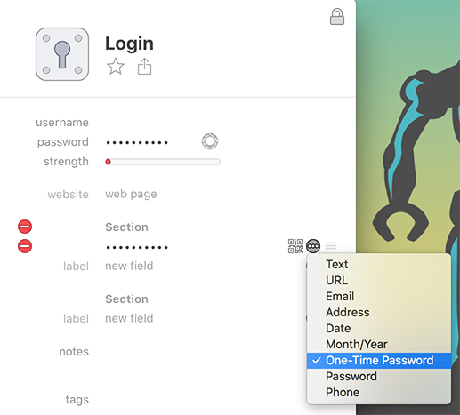
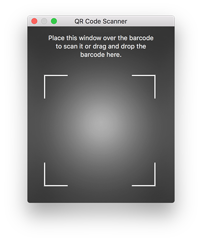

# Two-factor Authentication
In this guide you'll learn in principle how to setup two-factor authentication (2FA) for services which support it, along with an example. This is not intended to be a comprehensive guide to setting up two-factor authentication everywhere Sparkbox requires it.

## An Overview of 2FA
Two-factor authentication refers to the number of pieces of information required to sign in to a service. Most people will be familiar with signing in to Facebook or their bank with a password but some services go further than passwords, requiring an additional piece of information to prove you are who you claim to be. That's the second factor, the first being your password. It often comes in the form of a 6-digit number called a "token" and is tied in some way to the specific service asking for it. You will setup separate 2FA for each service.

## Methods

### SMS

__[Obtaining auth tokens via SMS is discouraged][nist-out-of-band-verifiers] and should only be used if the service offers no alternatives.__

SMS-based 2FA uses your mobile phone to receive text messages from the service in question. Their systems will generate a token and send it to your phone, you then type into your web browser. Tokens generated via this method are usually only valid for a few minutes. Setup is dependent on the service and it will always require your mobile phone number (obviously). An initial SMS message will have instructions for verifying that your setup is successful.

### Authenticator App

Apps are available for most mobile phone platforms to generate tokens. The two we rely on the most are:

* Google Authenticator [Android][ga-play-store] [iOS][ga-app-store]
* [Authy][authy-website]

These apps work by having you scan a QR code with your phone's camera. Once scanned, your screen will show a number and a countdown timer. The number is the token and the timer indicates when the token will expire. The service for which you are enabling 2FA may ask you to verify setup by entering the code being displayed.

### 1Password

In addition to creating and storing strong passwords for you, 1Password can also act as a token generator for 2FA.

To setup an existing account for 2FA, open find the login in 1Password and open it for editing. Add a new field and choose `One-Time Password` from the field type selector.

An icon resembling a QR code will appear at the right of the field. Clicking that icon will open this window.

That window will always stay on top of other windows. Click and drag it on top of the QR code and 1Password will detect it automatically.

[nist-out-of-band-verifiers]: https://github.com/usnistgov/800-63-3/blob/033fac493fd132cd6281b58ea7e430c0c222e40c/sp800-63b/sec5_authenticators.md#5132-out-of-band-verifiers
[authy-website]: https://www.authy.com/
[ga-play-store]: https://play.google.com/store/apps/details?id=com.google.android.apps.authenticator2&hl=en
[ga-app-store]: https://itunes.apple.com/us/app/google-authenticator/id388497605?mt=8
